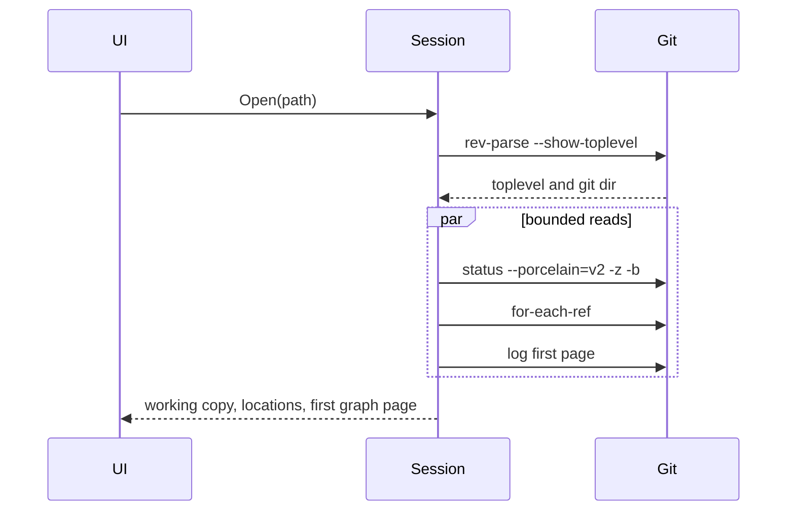

# Sextant

Cross-platform Git client. Performance is the first requirement. Working comfortably across several large repositories is the second. The day-to-day flow inside a repository follows Sublime Merge: locations, commit graph, files, diff, and the usual branch and sync actions.

The app is C# on .NET 10, Avalonia 12.1.3 with FluentTheme at compact density, and CommunityToolkit.Mvvm 8.4.2. It runs on Windows, Linux, and macOS. It uses the system `git` binary and that installation's configuration, hooks, attributes, and credential helpers.

## Status

- Plan saved: 2026-09-30
- Phase 1, daily loop: implemented, not yet clicked through
- Phase 2, history and local repair: implemented, not yet clicked through
- Phase 3, rewriting and conflicts: started. Continue and abort cover merge, rebase, cherry-pick, and revert. The working copy has the three-way editor. Interactive rebase, amend, and force-with-lease are not built.
- Phase 4, scale and depth: not started

Phase 1 code is in the app. `Sextant.Git.Tests` passed 36/36 against system git on 2026-09-30, including hunk stage/unstage, conflict abort, and push/pull to a local bare remote. The Windows app builds and starts. A throwaway repository was opened through the saved workspace, so open, status, and the first history page ran. The window follows the system light or dark variant. Opening a repository with no commits (a fresh local init, or an orphan branch) no longer treats the missing HEAD as a failure; history is loaded without that revision so other branches still show. Before the first commit, unstage and discard use `git rm` instead of `git restore`, and an untracked file's diff is read with `git diff --no-index`. Staging or unstaging a file keeps the working-copy file list at the same scroll position. The window and the Windows executable use the sextant mark in Assets/sextant.png and Assets/sextant.ico. The manual pass (two real repos, a conflict in the window, a commit with the machine's `user.name`, a credentialed fetch) has not been done. Linux and macOS have not been run.

Phase 2 is in the window as of 2026-10-01. The graph search box filters by subject, author, pasted sha, or `branch:name`, and a file's History action loads `git log` for that path. Blame, side-by-side, ignore-whitespace (`-w` for that view only), and an all-files diff are toggles on the diff. Line staging is available inline, and hunk staging covers added, untracked, and deleted text files as well as ordinary modifications. Selecting two commits shows the diff between them. Stash, tags, remotes, soft/mixed/hard reset, cherry-pick, and revert are in the locations list, the graph menu, or the toolbar. A conflicted cherry-pick or revert can be aborted; continue stays in Phase 3. Open, clone, and init are in the File menu and in the empty window. The saved-repository pane is gone: a repository is a tab, and a closed one is opened again from the file system. Open tabs still restore on startup. Inactive tabs stay unloaded until selected. The locations column is a virtualized tree: Branches, each remote, Tags, Remotes, and Stashes fold and unfold, and a refresh keeps that fold. Branch, remote-tracking, and tag names that share a `/` prefix are grouped under that prefix. Only rows on screen are created. The working copy has Stage all and Unstage all, and Commit is a split button whose menu action commits with `--no-verify`. `Sextant.Git.Tests` passed 59/59 against system git on 2026-10-01, and the Windows app builds with 0 warnings. The app was not launched for the pane removal, so the workspace file under `%APPDATA%\Sextant` was left as it is; the next real save omits the old pins list. Selecting a merge commit lists the files changed from its first parent, in one list reset, and the file list virtualizes those rows. `git show --name-status` on that merge is a combined diff and was empty: the World commit `Merge branch 'main' into audio/TBW-28368-CMS-Radios-KPDH` changes 19,959 files from its first parent and `git show` listed none. The patch of one file still loads on selection. The whole-commit patch stays behind the existing size cap until Load anyway. Each commit-graph row is two lines: the subject on the first, and the author, relative time, calendar date, short sha, and ref names on the second. The lane drawing fills that taller row. Windows CI is `.github/workflows/dotnet-desktop.yml`, from GitHub's .NET Desktop starter workflow. On push and pull request to master it runs on `windows-latest` with .NET 10, tests `Sextant.slnx`, publishes a self-contained win-x64 app, Authenticode-signs `Sextant.exe` and `Sextant.Git.dll` when the `Base64_Encoded_Pfx` and `Pfx_Key` secrets are set, and uploads that folder as an artifact. There is no MSIX packaging project. Tests that commit in a repository other than the fixture, including the push/pull clone, set that repository's own `user.name` and `user.email`. They do not use the machine's global identity, which a GitHub-hosted runner does not have. Phase 3 has started. A rebase is recognized from `rebase-merge` or `rebase-apply`, and Continue and Abort run `git merge --continue`, `git rebase --continue`, `git cherry-pick --continue`, `git revert --continue`, and the matching abort. Continue uses a no-op editor so git does not open one. An unmerged text file in the working copy opens in the three-way editor: ours, an editable result, and theirs, with the merge base on demand. Take ours and Take theirs fill that region. Save and stage writes the working-tree file and runs `git add` when the conflict markers are gone. If markers remain, the edit stays on disk and the path stays unmerged. A binary conflict stays on the external merge tool. `Sextant.Git.Tests` passed 71/71 against system git on 2026-10-01, and the Windows app builds with 0 warnings. The window was not launched. On 2026-10-01 the window theme is Avalonia's `FluentTheme` with `DensityStyle` Compact. That app build has 0 warnings, and the window was not launched for the switch. A diff is binary only when git's own notice is a line by itself (`Binary files … differ` or `GIT binary patch`). Markdown and source that mention those words stay text diffs. The toolbar is Pull, with Fetch in that split button, and Push beside it. Branch (Ctrl/Cmd+B), Stash (Ctrl/Cmd+Shift+S), Add remote, and Command log are in the Repository menu. History search is hidden until Repository → Search or Ctrl/Cmd+F. The window was not launched for this pass. The branch line is a centered rounded box with the local name, ahead/behind, and the running command. The upstream name is not shown there. Interactive rebase, amend, and force-with-lease are not built. The Phase 2 window has not been clicked through.

Update this block at the end of any session that lands or revises a step.

## Locked decisions

These were settled before the plan was written. A later session should treat them as constraints.

1. **First usable version is the daily loop.** Tabs, a virtualized commit graph, locations (branches, tags, remotes), the working copy, file and hunk staging, commit, checkout, fetch, pull, push, merge, and git errors shown in the UI. Interactive rebase, blame, file history, and line staging wait.
2. **Many repositories means tabs.** A repository is an open tab. Full history, the watcher, and diffs run for the active tab. An inactive tab stays unloaded until it is selected. A closed repository is opened again from the file system (File menu, or the empty window). There is no saved-repository list and no badge poll of closed repositories.
3. **Conflict handling is finished only when Sextant has an in-app three-way editor** (ours, result, theirs), with the configured external mergetool still available. The daily loop still has to detect a conflict and offer a way out, described in Phase 1.
4. **Sextant reads git configuration and writes it only after an explicit confirmation.** The confirmed writes we expect are local performance keys, and `safe.directory` when git itself refuses the repo.
5. **Every read and write goes through the system git binary.** Repository data is not loaded through libgit2 or any other object database.
6. **The selected file is the only diff Phase 1 renders.** A dirty tree must not lay out every file's diff at once. A later phase can show a virtualized all-files diff fed by a single `git diff`.
7. **Phase 1 hunk staging is for ordinary tracked text modifications.** New files, deletions, renames, mode changes, and binary files stage or unstage as a whole file. Line staging and partial staging of untracked files wait.
8. **Phase 1 history navigation is single-select.** The diff is inline. Side-by-side and multi-commit range diffs wait.
9. **Sextant does not ship a git binary, a credential store, or hosting-provider integration** (no GitHub, GitLab, or Azure PR client).

## What "fast" means

Speed comes from calling git rarely, asking for machine-readable slices, and painting only what is on screen.

- Opening a repo runs a bounded first page of history (about 300 commits), one status, and one ref listing. It does not walk the whole history and it does not diff every file.
- The graph list is UI-virtualized with a fixed row height. Scrolling rows that are already loaded starts no git process.
- Further history loads as a page (about 500 commits) when the user nears the end of the loaded prefix. Lane geometry is computed from that prefix, so pages always extend a prefix rather than loading a detached window.
- Soft cap: 50,000 loaded commit rows per open tab, then an explicit "load more". Metadata only. A tab that is closed drops its rows.
- Selecting a commit or a file cancels the previous file-list or diff process for that tab.
- An inactive tab never runs `git log` or `git diff`. It stays unloaded until selected.
- Network operations (clone, fetch, pull, push) are exclusive per repository, show progress, and cancel only when the user cancels them.
- Read commands pass `--no-optional-locks` so a refresh does not rewrite the index and wake the file watcher.

Measure these on a real repository and record the numbers in this file when Phase 1 is far enough to time them. Targets, on a machine where the repo is already on disk and git's commit-graph is warm:

- First graph paint after open: the first page is requested with a single `git log`, and the list is visible as soon as that page is parsed. Budget 300ms of Sextant overhead beyond git's own time on a modest repo.
- Returning to an open tab: the graph is still in memory, so the switch does not re-run `git log`.
- Status of an idle small repo: one `git status`, no per-file follow-up.

A large working tree is allowed to be slow until `feature.manyFiles` and `core.fsmonitor` are on. Sextant suggests those keys; it does not pretend status is instant without them.

## Solution shape

Today the repo is a single Avalonia executable: `Sextant.slnx`, `src/Sextant.csproj`, `Program.cs`, `App.axaml`, `MainWindow`, and `MainViewModel`. Nullable is on. Target framework is `net10.0`. The `Models` folder is an empty placeholder.

Add one class library and one test project. Leave the app project where it is.

```
Sextant.slnx
PLAN.md
src/Sextant.csproj                 Avalonia shell, views, view models
src/Sextant.Git/Sextant.Git.csproj process runner, parsers, graph, sessions, workspace file
tests/Sextant.Git.Tests/           real git in temp repos, plus parser fixtures
```

`Sextant.Git` does not reference Avalonia. View models call session methods. They do not build `ProcessStartInfo` or git argument lists. Argument lists live in the library so tests can lock them down.

Compose the object graph in `App.axaml.cs`. A DI container is unnecessary.

Suggested library layout, adjusted as files grow:

```
src/Sextant.Git/
  GitLocator.cs
  GitProcess.cs
  RepositoryScheduler.cs
  RepositorySession.cs
  Parsing/     StatusParser, LogParser, RefParser, DiffParser
  Graph/       LaneAssigner
  Staging/     HunkPatch
  Workspace/   WorkspaceStore, AppPaths
  Models/
```

Remove the empty `Models` folder include from the app project once the app no longer needs the placeholder.

## Git process

### Finding git

Use `git` on `PATH`. If it is missing, say so and let the user pick an executable. Remember that absolute path in Sextant settings. Do not scan `Program Files` or `/usr/local` and silently bind a different git than the one the user runs in a terminal.

Probe `git --version` at startup. Porcelain v2, `git switch`, and `git restore` are required. Treat Git 2.43 or newer as the supported floor. On an older binary, show the version and refuse to open repositories rather than guessing which flags exist.

### How a process is started

- `ProcessStartInfo.ArgumentList`. No shell, no concatenated command string.
- `git -C <toplevel>` with a full path from `Path.GetFullPath`.
- `--` before any pathspec.
- Inherit the user environment so `SSH_AUTH_SOCK`, ssh-agent, GPG, `GIT_SSH_COMMAND`, and credential helpers keep working.
- Set `GIT_TERMINAL_PROMPT=0` so git cannot block on a hidden stdin prompt. GUI helpers (Git Credential Manager, osxkeychain, libsecret) still work because they do not need that prompt.
- Do not set `LC_ALL`. Parsers use NUL and porcelain formats, which are locale-independent.
- Do not override `user.name`, `user.email`, `commit.gpgsign`, diff options, hooks, attributes, or `pull.ff` / `pull.rebase`. A signing commit may sit on "Committing…" until pinentry finishes. That wait is the user's git config working.
- Merge and pull in Phase 1 pass `--no-edit` so git accepts the default message instead of launching an editor. Commit messages are passed with `commit -F <tempfile>`. The tempfile lives in the user temp directory, is deleted after the command, and is the only place the message bytes are stored.
- If a hook launches a program anyway, the tab shows that the command is still running and Cancel kills the process tree.
- Decode stdout as UTF-8 by default. If the repo's `i18n.logOutputEncoding` is set, use that for human text. Paths come from `-z` records, not from quoted escaped paths.
- Before writing a command to the on-screen log, strip URL userinfo so a token in an HTTPS remote does not land in the log.

Cancellation uses `Process.Kill(entireProcessTree: true)`, which is cross-platform on .NET 10. Cancel is wired to the tab's lifetime: closing a tab cancels its reads and kills its children. A write that the user did not cancel is allowed to finish, except network operations, which have an explicit Cancel button.

There is no global timeout on local commands. A slow `git status` on a huge tree is a real result, and it is the signal for the performance suggestion. Network commands run until they exit or the user cancels.

### Scheduler

One `RepositoryScheduler` per open tab.

- At most two read processes at once (the open path wants status and the first log page together).
- Writes are exclusive: commit, checkout, merge, stage, discard, and any ref update.
- Starting a write cancels in-flight cancelable reads (status, log, diff, ref list) and waits until they have exited, then runs the write. It does not cancel another write.
- Clone, fetch, pull, and push count as writes. A new status does not preempt them. The user can cancel the network command itself.
- Each request carries a generation token. A diff result whose token is stale is discarded and never applied to the view.



### Commands Phase 1 actually runs

Reads add `--no-optional-locks`. Writes do not.

| Action | Arguments after `git -C <root>` |
| --- | --- |
| Identify | `rev-parse --show-toplevel` and `rev-parse --absolute-git-dir` |
| Status | `--no-optional-locks status --porcelain=v2 -z -b` |
| Refs | `--no-optional-locks for-each-ref` with a NUL format of object name, refname, HEAD marker, upstream short name |
| Log page | `--no-optional-locks log -z --date-order HEAD --branches --tags --remotes --format=%H%x1f%P%x1f%at%x1f%an%x1f%ae%x1f%s -n <count> --skip <skip>` |
| Commit files | `--no-optional-locks diff -z --name-status <first-parent> <sha>`. A commit with no parent stays `show -z --format= --name-status <sha>`. `git show` on a merge is a combined diff and lists only paths that differ from every parent, so a clean merge would render no files |
| Unstaged diff | `--no-optional-locks diff -- <path>` |
| Staged diff | `--no-optional-locks diff --cached -- <path>` |
| Stage file | `add -- <path>` |
| Stage all | `add -A`. While a merge, cherry-pick, or revert is conflicted, `add -- <paths>` for the non-unmerged paths so those conflicts stay unmerged |
| Unstage file | `restore --staged -- <path>` |
| Unstage all | `restore --staged :`. Before the first commit, `rm -r --cached -f -- .` |
| Discard tracked | `restore --source=HEAD --worktree --staged -- <path>` after confirmation |
| Discard untracked | `clean -f -- <path>` after confirmation. Never `-d`, `-x`, or a pathspec-less clean |
| Commit | `commit -F <file>`. The split button's other action is `commit --no-verify -F <file>`, which skips hooks for that commit only |
| Switch | `switch -- <branch>` |
| Create branch | `switch -c <name>` |
| Delete branch | `branch -d <name>`. If git says the branch is not fully merged, confirm and run `branch -D`. Any other refusal shows stderr |
| Merge | `merge --no-edit <branch>` |
| Abort merge | `merge --abort` |
| Fetch | `fetch --progress` |
| Pull | `pull --progress --no-edit` |
| Push | `push --progress` |
| Push with upstream | `push --progress -u <remote> <branch>` |
| External mergetool | `mergetool --no-prompt -- <path>` |
| Init | `init` in the chosen folder, then open it |
| Clone | `clone --progress <url> <path>`, then open it |
| Read config | `config --null --list`, cached on the session |
| Confirmed local setting | `config --local <key> <value>` |

`git log` de-duplicates commits, so listing `HEAD` together with `--branches --tags --remotes` still shows a detached HEAD without a second copy of every commit. Stashes are `refs/stash` and stay out of this walk until the stash phase.

Do not pass `-M` or other diff-algorithm overrides on `git show` / `git diff`. The user's `diff.renames` and related keys then apply. Join decoration (branch and tag chips) from `for-each-ref`, not from `%D`, because decoration text is awkward to parse and the locations column already needs the ref list.

On any successful write, refresh status and refs. If `HEAD` or the ref tips changed, drop the loaded graph prefix, load the first page again, and scroll to the top. Offset paging is only valid for an unchanged rev walk.

Respect `status.showUntrackedFiles`. Do not force `-uall`.

### Parsers

The oracle for porcelain v2 `-z` is the documentation shipped with the installed git, plus fixture output captured in tests. A known footgun: `-z` NUL-terminates record paths, while the `# branch.*` header lines stay line-oriented. Test modified, added, deleted, renamed, untracked, and unmerged records.

Log records are NUL-separated. Fields inside a record are `%x1f`-separated, in the format order above. A root commit has an empty parent field.

Unified diff parsing has to understand `diff --git` headers, new file, deleted file, rename headers, `@@` hunks, `+` / `-` / context lines, the `\ No newline at end of file` marker, and binary notices. A binary notice is its own diff line: `Binary files … differ` or `GIT binary patch`. The same words inside a markdown, source, or other text line are file content. Binary patches are stored as "binary" and not turned into lines.

Parse off the UI thread. If a single file's diff exceeds 20,000 lines, or the diff text exceeds about 1 MB, show the file header and a "load anyway" action instead of building the line list immediately.

### Hunk staging

For a tracked text file that is a plain modification:

1. Take the unstaged diff (`git diff`) or the staged diff (`git diff --cached`) for that one path.
2. Build a patch that keeps the file header and only the chosen hunk, with the hunk header's line counts matching the included lines.
3. Stage with `git apply --cached <patch>`. Unstage with `git apply --cached --reverse <patch>`.
4. On a reject, show stderr. There is no interactive `git add -p` fallback, because that needs a terminal.
5. Refresh status and that file's diff.

Hide hunk buttons for untracked files, deletions, renames, mode-only changes, and binary files. Those use the whole-file stage and unstage commands.

### Commit graph lanes

Walk the loaded prefix from newest to oldest, which is also top to bottom on screen. Keep a list of lanes. Each lane remembers the commit id it expects next.

For each commit:

- Lanes whose expected id is this commit arrive here.
- Draw the node in the first arriving lane, or in the first free lane when none arrive.
- The first parent inherits that lane.
- Each extra parent takes a free lane, or an existing lane that already expects that parent.
- Arriving lanes that were not reused close.
- A row paints vertical segments for lanes that pass through, a node at its lane, and edges for parents that change lane.

Cover this with fixture repositories: a straight line, a branch that merges back (a diamond), and two branches alive at once. Each row is two lines and a fixed height. The subject is the first line and ellipsizes only when it is wider than the column. The second line is the author, relative time, calendar date, short sha, `HEAD` when this commit is checked out, and the refs that point at it. Lane colors come from a small fixed palette, and the lane drawing fills the row so the lines stay connected.

Order is `git log --date-order`. The checked-out commit is marked. It stays in date order rather than being pulled to the top.

### Working copy row

The first graph row is always the working copy. Its first line reads "Working copy". Its second line reads "Clean", "No commits yet", a short dirty summary such as the unstaged and staged counts, or "Merge in progress" when `MERGE_HEAD` is present (and the same for a cherry-pick or revert). Selecting it shows the file list split into staged and unstaged, the inline diff of the selected file, and the commit box. Selecting a commit shows that commit's metadata and its changed files, and hides the commit box.

Opening a dirty repo selects the working copy. Opening a clean repo selects the working copy too, so the commit box and the clean file list are the landing state. The user moves into history by selecting a commit.

### Three-way merge editor (Phase 3)

Recorded here so Phase 1 does not paint itself into a corner.

During a conflict, index stages are available as `git show :1:<path>` (base), `:2:<path>` (ours), and `:3:<path>` (theirs). The result starts as the working-tree file. The editor shows ours, the result, and theirs. A merge-base column can be toggled. Each conflict region has "take ours" and "take theirs". The result column is editable. Saving writes the working-tree file and `git add -- <path>`.

Phase 3 also watches `.git` state (`MERGE_HEAD`, `rebase-merge` / `rebase-apply`, `CHERRY_PICK_HEAD`, `REVERT_HEAD`) and offers continue and abort for each in-progress operation.

Until that editor exists, Phase 1 still must not trap the user inside a conflict. See the Phase 1 conflict interim.

## Workspace and settings

App state is per user, outside the git repos and outside the Sextant source tree.

| OS | Directory |
| --- | --- |
| Windows | `%APPDATA%\Sextant` |
| Linux | `$XDG_CONFIG_HOME/sextant` or `~/.config/sextant` |
| macOS | `~/Library/Application Support/Sextant` |

- `workspace.json`: open tabs (path, order), active tab path, and splitter positions. An older file may still contain a pins list; those fields are ignored and are not written back.
- `settings.json`: optional absolute git path, whether to reopen tabs (default yes).

Identity of a repository is its toplevel path. Normalize with `Path.GetFullPath`, strip a trailing separator, and compare case-insensitively on Windows only. One tab per toplevel. Opening a path that is already open focuses that tab. Opening a subdirectory resolves to the toplevel, and the stored tab path becomes that toplevel once the session has loaded. A linked worktree has its own toplevel and opens as its own tab in Phase 1; creating and listing worktrees is still Phase 4. The same is true of a submodule checkout: opening that directory works because it is a repository, and discovering submodules from the parent is Phase 4.

Closing a tab disposes that session. The same repository is opened again from the file system. Sextant never deletes a repository's files.

Reopen on startup restores tabs and loads the active one immediately. Inactive reopened tabs stay unloaded until selected.

### Watching

Active tab watcher:

- Watch `.git/HEAD`, `.git/index`, and `.git/refs`. Resolve the git dir with `rev-parse --absolute-git-dir` so worktrees watch the right directory. Also notice `packed-refs` mtime.
- Debounce bursts by about 200ms, then run one status. Coalesce overlapping events.
- Do not put a `FileSystemWatcher` on the whole working tree of a large repo. On Linux that hits inotify limits as soon as build output or dependencies are present. Working-tree edits are picked up by refreshing on focus, by the `.git/index` watch when the editor or git touches the index, and by an explicit Refresh (F5).
- If `core.fsmonitor` is already set, this is enough, because `git status` itself is cheap.
- If the watcher errors, keep refresh-on-focus and surface the performance suggestion.

### Performance suggestion

After a status that took longer than about 1.5 seconds, if the relevant keys are unset, offer a confirmation dialog that lists the exact commands:

- `git config --local feature.manyFiles true`
- `git config --local core.fsmonitor true`

Both are local to that repository's `.git/config`. The user can accept either, both, or neither. If git rejects `core.fsmonitor` on that version or platform, show stderr. Do not enable `git maintenance`, and do not rewrite global git config for speed.

### Dubious ownership

When git refuses a repo as dubious, show the path and git's message. The repair is `git config --global --add safe.directory <path>`, and it has to be global because git will not read the repo config until the directory is trusted. Run it only after a confirmation that says it is a global config change.

### Credentials

Phase 1 has no password dialog and no askpass helper. Authentication that already works for the user's terminal git (credential manager GUI, ssh-agent, osxkeychain) works here because the environment is inherited. A key that would have asked for a passphrase on the terminal fails with git's own error on screen. An askpass UI is out of scope until a later phase needs it.

## Phase 1 shell

One main window. Tabs are not torn off into new windows.

```
+--------------------------------------------------------------+
|  [ repo A ] [ repo B ]                                       |
|            ( main · ↑1 ↓0 )           Pull  Push           |
|-----------+----------------------+---------------------------|
| Locations | Commit graph         | Files                     |
| Branches  | Working copy         | staged / unstaged         |
| Remotes   | commits              +---------------------------|
| Tags      |                      | Diff                      |
|           |                      | hunk actions              |
+-----------+----------------------+---------------------------+
```

The window is the open tabs and the active repository. A repository is a tab. Closing a tab drops that session.

The details side shows one selected file. When the working copy is selected, the commit message box sits at the top of that details area, matching Sublime Merge's commit placement. Under that box, Stage all and Unstage all act on the whole working copy. Commit submits the index as it stands. It does not pass `-a`. The commit control is a split button: the main action runs `commit -F`, and the menu action runs `commit --no-verify -F` so hooks are skipped only for that one commit. An empty index does not commit; the box explains that there is nothing staged. There is no amend in Phase 1.

Locations are a virtualized list drawn as a tree. Branches, each remote's tracking branches, Tags, Remotes, and Stashes are separate nodes that fold and unfold. Inside branches, remote-tracking branches, and tags, names that share a `/` prefix become a folder: `feature/grass` and `feature/figma-ui` sit under `feature`. A slashed name that shares no prefix with another stays one row. A refresh keeps every fold, including those folders. Only the rows on screen are created, so a repository with thousands of tags does not build a control per ref. Actions on a row and on graph context menus: checkout, create branch at HEAD, merge into HEAD, delete branch, set upstream. Tags can be revealed and deleted.

The local branch name, ahead/behind counts, and the command in progress sit in a centered rounded box under the tabs. The box shows the local branch only. The upstream, such as `origin/master`, stays off that box. Pull and Push stay at the right of the same row.

Toolbar buttons act on the active tab. Pull is the face of a split button, and Fetch is the item in its menu. Push stays its own button. Continue, Abort, and Cancel stay on the toolbar while they apply. Branch, Stash, Add remote, and Command log are in the Repository menu. Branch is Ctrl/Cmd+B. Stash is Ctrl/Cmd+Shift+S. Fetch, pull, and push follow the user's fetch, pull, and push config, including `fetch.prune` and `pull.rebase`. They do not force prune and they do not force a merge. Push with no upstream asks which remote to use and then runs `push -u`. There is no fetch-all action in Phase 1.

The graph search field is hidden until Repository → Search, or Ctrl/Cmd+F, which toggles it and focuses the field. Enter in the field still runs the search. While a search is applied, its caption stays visible above the graph.

Command palette (Ctrl/Cmd+P) lists the commands that exist: open, clone, init, fetch, pull, push, refresh, checkout, create branch, merge, commit, search history. It is a filterable list, not a plugin host.

Other keys: Ctrl/Cmd+O open repository, Ctrl/Cmd+Tab next tab, Ctrl/Cmd+W close tab, F5 refresh. The graph is a list, so arrow keys move the selection.

Dialogs: open folder, clone (URL, parent directory, folder name, progress), init (pick a folder), create branch, confirmation for discard and for config writes.

Open, clone, and init are in the File menu (Ctrl+O opens a repository). An empty window still offers the same three actions in the center. There is no list of recently opened repositories.

Operation feedback, per tab:

- The command that is running, including "Committing…" and "Fetching…".
- A dismissible banner with the last failure, exit code, and stderr, with a way to copy it.
- A command drawer with argv (secrets stripped), duration, exit code, and stderr. This drawer is also the performance trace.

Progress for clone, fetch, pull, and push: pass `--progress` and parse carriage-return progress on stderr. Progress lines are not failures.

Theme: Avalonia's `FluentTheme` with `DensityStyle="Compact"`. The window follows the system light or dark variant. Compact is the density for this desktop application: 14px content, 24px text controls, and the theme's tighter list and button padding. Graph, locations, and file rows stay dense enough to scan. Do not add a second theme beside Fluent.

Keyboard focus and contrast should be the Fluent defaults so the UI stays usable. Do not build a custom accessibility tree in Phase 1.

### Phase 1 conflict interim

Merge is in the daily loop, and the three-way editor is not. When status reports unmerged paths or `MERGE_HEAD` exists:

- The working-copy row and a banner say a merge is in progress.
- Conflicted files are marked in the file list. Their diff shows the working-tree content, conflict markers included.
- Actions: Abort merge, and Open in external merge tool when the user wants `git mergetool` for that file.
- After the conflicts are resolved and staged (by the external tool, or by editing the file elsewhere and staging), the normal commit box concludes the merge. Prefill it from `MERGE_MSG` when that file exists.
- If commit is attempted while unmerged paths remain, git fails and the banner shows that stderr.

This interim is what makes merge safe to ship early. The working copy now opens a selected unmerged text file in the three-way editor instead of the marker diff. The external merge tool stays on the file.

### Phase 1 steps

Land these in order. Each step should leave the solution building.

1. Save this plan as `PLAN.md` (the approval step).
2. Add `Sextant.Git` and `Sextant.Git.Tests` to `Sextant.slnx`. App project references the library.
3. `GitLocator` and the process runner: argument list, inherited environment, tree kill, stdout and stderr separated, progress lines split out of stderr, URL userinfo stripped from logs.
4. Status parser and fixtures, including a conflicted record.
5. Log parser, ref parser, diff parser, each with fixtures from the local git.
6. `RepositoryScheduler` tests: two reads can overlap, a write cancels an in-flight read, a write does not start while another write runs, a stale generation is dropped.
7. `RepositorySession` open path: rev-parse, status, refs, first log page.
8. `WorkspaceStore` round-trip for open tabs in a temp directory. App paths per OS. An older workspace file that still has a pins list still loads.
9. Shell: tabs, empty state, open folder. Wire open to the session and show the first graph page, locations, and working-copy summary.
10. Checkout, create branch, delete branch, set upstream, merge, fetch, pull, push, including the no-upstream prompt and the conflict interim.
11. File list, whole-file stage and unstage, discard confirmations, inline diff, hunk stage and unstage, commit via `-F`.
12. Active-tab git-dir watcher, performance suggestion, dubious-ownership confirmation, command banner and drawer.
13. Clone and init.
14. Thin command palette and the four shortcuts.
15. Manual pass on Windows: two real repos as tabs, a repo with a few thousand commits, a merge that conflicts, a commit that uses the machine's existing `user.name`, and a fetch that uses the existing credential helper.

### Phase 1 exit

- Three repositories can be open as tabs, and an inactive tab does not run log or diff.
- Restarting the app restores the open tabs and the active tab.
- Staging one hunk of a multi-hunk file and committing produces a new commit whose diff is only that hunk.
- Fetch, pull, and push run the system git and surface its errors.
- A conflicted merge can be aborted, or handed to `git mergetool`, or concluded with a commit after the paths are staged.
- Parser, hunk-apply, and scheduler tests pass against the system git.

## Phase 2 — history and local repair

Read-mostly depth and the local operations that do not need a rebase todo editor.

- Commit search by subject, author, and revision, using `git log` greps and `git rev-parse` for a pasted sha. Include a `branch:` style filter in the same box.
- File history with `git log -- <path>`, opened from a file in the list.
- Blame via `git blame --line-porcelain`, virtualized, for the selected file at the selected commit.
- Stash: list, push, pop, apply, drop. Stash refs may then appear in the graph.
- Reset soft and mixed. Hard reset only behind a confirmation that names the commit that will be discarded.
- Cherry-pick and revert of the selected commit.
- Create and delete tags. Delete is a confirmation.
- Add, remove, and rename remotes.
- Side-by-side diff and an ignore-whitespace toggle that passes the matching git diff flag for that view only.
- Line staging, and hunk staging for untracked files.
- Multi-select on the graph: the file list and diff show `git diff` between the older and newer selected commits.
- Virtualized all-files diff from one `git diff` invocation, as an alternate details mode.

Still no interactive rebase and no in-app conflict editor in this phase.

## Phase 3 — rewriting and conflicts

This phase is what "conflict handling is done" means.

- In-app three-way editor as specified above. External `git mergetool` stays on the file.
- Continue and abort for merge, rebase, cherry-pick, and revert, based on `.git` state.
- Interactive rebase as a list of the selected commits: reorder, squash, fixup, edit, drop, reword. Drive it with `GIT_SEQUENCE_EDITOR` pointing at a Sextant-controlled editor script, or an equivalent non-interactive todo file, so git never opens vim.
- Edit commit message, amend the tip, and edit an older commit's contents through that rebase flow.
- Push `--force-with-lease` as a separately labeled action. A plain `--force` is not the button.

A rewrite of commits that are already on a remote is called out in the confirmation before the force-with-lease push.

## Phase 4 — scale and depth

- Submodule list on the parent, with "open as tab".
- Worktree list, add, and open as tab. Opening an existing worktree directory already works in Phase 1.
- Sparse checkout: when `core.sparseCheckout` is set, say so, and do not try to materialize excluded paths.
- Git LFS pointers in the diff shown as pointers, without downloading the blob, unless the user asks.
- Syntax highlighting of the visible diff viewport only. Do not highlight a whole large file up front.
- Image diff for common formats, with a size cap.

## Out of scope

- A second repository reader (libgit2 or otherwise). If a measured log or status path cannot meet the budget with system git, write the numbers down in this file and revisit the decision with those numbers. Do not add the dependency as an optimization guess.
- Hosting APIs, pull request review, and issue trackers.
- A bundled git, an embedded credential vault, and a commit-message generator.
- A plugin API and user-defined command hosting. Sublime Merge has custom commands; Sextant does not, until a phase in this file says otherwise.
- Fetch-all unbounded parallelism, whole-tree file watchers, and per-file git processes while painting a commit.

## Tests

Default test run uses the system git in temporary repositories and deletes them afterwards. Cover at least:

- Porcelain v2 status: modified, added, deleted, renamed, untracked, unmerged.
- Log page: linear history, a merge commit's parents, a root commit, NUL field splitting.
- Refs: current branch marker and an upstream.
- Diff: a two-hunk modification, a new file, a deletion, a rename, a binary file.
- Hunk apply: stage the middle hunk of a three-hunk file, assert `git diff --cached` contains only that hunk, then unstage it. Run this where the temp repo's `core.autocrlf` matches the platform default, and once with it forced off, so line endings are part of the test.
- Scheduler cancellation and write exclusion.
- Workspace JSON round-trip.

An opt-in bench, excluded from the default run, generates a repository of about 20,000 commits and checks that the first page returns a bounded count and does not require loading the rest.

UI checks are manual on the desktop app. There is no browser surface. The Phase 1 manual pass is the UI exit criteria. Linux and macOS use the same runner; verify them on those systems when they are available, and record what was not run.

## Risks to watch

- `git apply` rejecting hunks when smudge or clean filters, or line-ending conversion, rewrite the patch. The autocrlf tests are the early warning. Surface stderr rather than retrying with a cleverer patch in the same step.
- Lane assignment on octopus merges and criss-cross histories. Phase 1 fixtures cover a single merge commit and two live branches. Add a fixture when a real repo draws wrong.
- File watcher limits on Linux. The git-dir-only watch is the mitigation. If a platform cannot watch even `.git`, refresh-on-focus still has to work.
- Windows process-startup cost. The command table is the cap on how many processes one gesture starts. Do not add a process per row or per file to "just get a name".
- Credential helpers that only speak to a console. Known Phase 1 limitation, shown as a git error, not papered over with a stored password.
